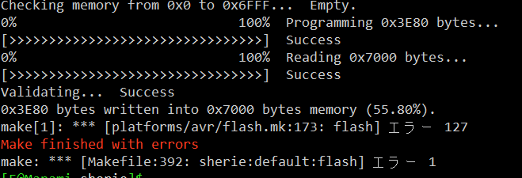

# Sherie
Sherieはオーソリニアな40％キーボードです。

# 組み立て方法
ほとんどの部品は実装済みです。
リセットスイッチとキーソケットだけはんだ付けしてください。
そのあと組み立ててください。

# ファームウェア書き込み
QMK toolboxを使って.hexファイルをキーボードに書き込んでください。QMK MSYSやpromicro web updaterでは書き込めない可能性があります。

# viaのキーマップを書き込んだ上で
jsonファイルは以下を読み込ませることで、via/remapを使用することができます。
qmk_firmware\sherie\keymaps\via\sherie.json 

## コマンド
cd 
`cd /c/Users/F/qmk_firmware/keyboards/sherie`
コンパイル
`qmk compile -kb sherie -km default`
`qmk compile -kb sherie -km via`
フラッシュ(フラッシュはQMK toolboxを使うことを推奨します)
`qmk flash -kb sherie -km default`

## memo

USBとかの周りはGNDベタにしたほうがいいかも。
udb-sのPCBを参照。

## Ref
[1]https://note.com/copkbd/n/n587afde1812e

ATMEGA32U4直付の手順は以下を参照します。
[2]https://wiki.ai03.com/books/pcb-design/chapter/pcb-designer-guide

[3]https://taro-hayashi.github.io/LetsMakeaKeypadWithAtmega32u2/

typeC周りの回路
[4]https://github.com/Unified-Daughterboard/UDB-S

静電気対策（特に金属ケースの場合は参照）
[5]https://gist.github.com/s-show/286ffb1f5d9c886b514ff7a37e6d8d37

ベタGNDとか
[6]https://taro-hayashi.github.io/LetsMakeaKeypadWithAtmega32u2/

[7]https://qiita.com/Sugimoto_Yuuki/items/860ca6a57c2501f1cbab

[8]https://docs.qmk.fm/driver_installation_zadig

## バグ
QMK MSYSでflashできない場合
以下のようなエラーが出てflashに失敗する場合があります。

 
これは実はエラーができても書き込み自体はできているっぽいです。
 
エラーなく書き込みたい場合は、QMK Toolboxを使って書き込みます。
 
エラーの原因はよくわからないが、おそらくポートのデバイスではなくてUSBデバイスとして認識しているのが原因。
 
おそらくですが、USBのドライバーが原因でした。[7]を参照し、ドライバーをWinUSBに書き換えます。こうするとQMK toolboxでエラーなしで読み込むことができるようになりました。
ただし、winUSBにするとQMK MSYSではflashできないぽいです。
ちなみにドライバーを変えるとシリアルポートで認識するようにもでるようにもできるっぽいです。
ただ、[8]によると、atmega32uの推奨driverはwinUSBなので、大人しく従う方がいいと思います。

## 改良点
1. 真ん中にネジ穴追加
1. スタビライザーのネジ穴のワッシャー分もボトムプレートの範囲を広げる
1. 電源のLEDが明るすぎる。暗くするのと、ジャンパでLEDを接続しないこともできるようにする
1. 1.5uのキーにもスタビライザーを追加？
